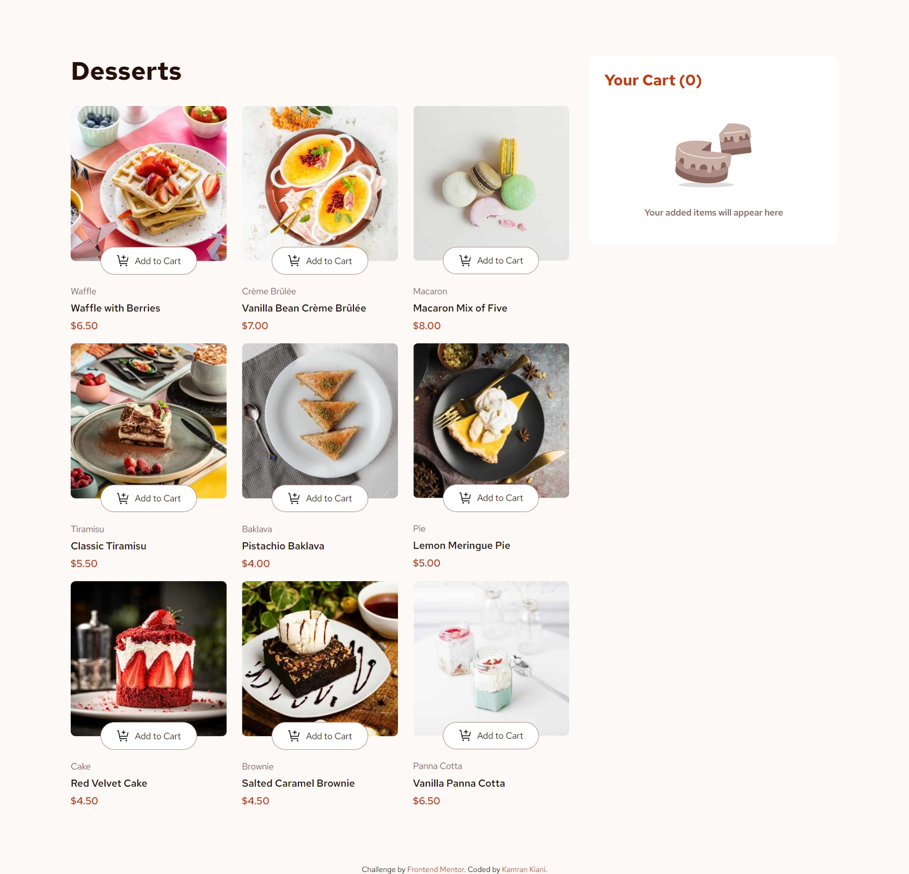

# Frontend Mentor - Product list with cart solution

This is a solution to the [Product list with cart challenge on Frontend Mentor](https://www.frontendmentor.io/challenges/product-list-with-cart-5MmqLVAp_d).

## Table of contents

- [Overview](#overview)
  - [The challenge](#the-challenge)
  - [Screenshot](#screenshot)
  - [Links](#links)
- [My process](#my-process)
  - [Built with](#built-with)
  - [What I learned](#what-i-learned)
  - [Continued development](#continued-development)
  - [Useful resources](#useful-resources)
- [Author](#author)
- [Acknowledgments](#acknowledgments)

## Overview

### The challenge

Users should be able to:

- Add items to the cart and remove them
- Increase/decrease the number of items in the cart
- See an order confirmation modal when they click "Confirm Order"
- Reset their selections when they click "Start New Order"
- View the optimal layout for the interface depending on their device's screen size
- See hover and focus states for all interactive elements on the page

### Screenshot

### Links

- Solution URL: [GitHub](https://github.com/kaamiik/fm-Product-list-with-Cart-using-react-tailwind)
- Live Site URL: [Vercel](https://fm-product-list-with-cart-using-react-tailwind.vercel.app/)

## My process

### Built with

- Semantic HTML5 markup
- CSS custom properties
- Flexbox
- CSS Grid
- Mobile-first workflow
- [React](https://reactjs.org/) - JS library
- Tailwind
- Accessibility

### What I learned

In this project, I learned about state management using the `useState` hook in React, as well as how to utilize `useEffect` for handling side effects in functional components. I also explored the implementation of `forwardRef` for managing component references. Additionally, I focused on creating different components and practicing prop delegation to enhance reusability. I used prop drilling for state management in this project, but I plan to use the Context API for more efficient state management in future projects. To improve accessibility, I added a `div` with the `sr-only` class to provide aria-live announcements for screen readers when items are added or removed. Furthermore, I used Tailwind v4 for this project, which does not require a `tailwind.config.js` file, and I utilized the `@theme` directive along with custom properties to add custom styles.

## Author

- Frontend Mentor - [@kaamiik](https://www.frontendmentor.io/profile/kaamiik)
- X - [@kiaakamran](https://www.x.com/kiaakamran)
